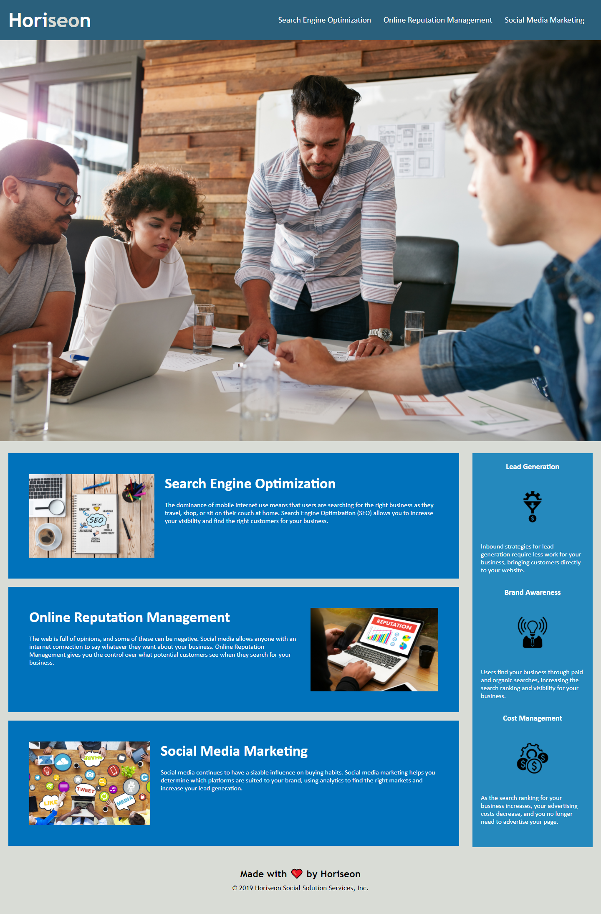

# horiseon-refactor
My refactoring of the Horiseon Website.

## Description

For this project I set out to refactor the HTML and CSS for Horiseon's website in order to maximize accesibility for users, search engines, and other developers.  

This website was refactored so that the items in the nav bar properly link to the corresponding sections in the webpage below, the images have alt attributes, and the HTML has been restructured using semantic tags for better search engine optimization. Several redundant tags, classes, and id's were removed in favor of cleaner, more concise code.

The CSS styles have also been consolidated and reordered to follow CSS conventions.

## Deployed Page and Code

The website is viewable at https://gregriss.github.io/horiseon-refactor/
and the code is viewable at https://github.com/gregriss/horiseon-refactor.git 

## Usage

Horiseon's website is simple and intuitive to use. Simply click an item in the nav bar in the top right of the page to access the corresponding section of the site.

Here is a screenshot of the deployed page: 

## License 

Copyright (c) [2020] [Greg Riss]

Permission is hereby granted, free of charge, to any person obtaining a copy of this software and associated documentation files (the "Software"), to deal in the Software without restriction including without limitation the rights to use, copy, modify, merge, publish, distribute, sublicense, and/or sell copies of the Software, and to permit persons to whom the Software is furnished to do so, subject to the following conditions:

The above copyright notice and this permission notice shall be included in all copies or substantial portions of the Software.

THE SOFTWARE IS PROVIDED "AS IS", WITHOUT WARRANTY OF ANY KIND, EXPRESS OR IMPLIED, INCLUDING BUT NOT LIMITED TO THE WARRANTIES OF MERCHANTABILITY, FITNESS FOR A PARTICULAR PURPOSE AND NONINFRINGEMENT. IN NO EVENT SHALL THE AUTHORS OR COPYRIGHT HOLDERS BE LIABLE FOR ANY CLAIM, DAMAGES OR OTHER LIABILITY, WHETHER IN AN ACTION OF CONTRACT, TORT OR OTHERWISE, ARISING FROM, OUT OF OR IN CONNECTION WITH THE SOFTWARE OR THE USE OR OTHER DEALINGS IN THE SOFTWARE.